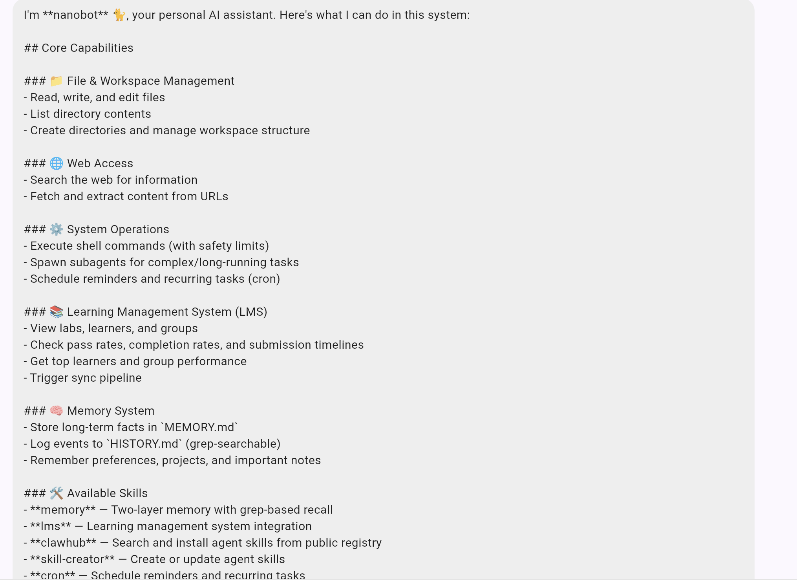

# Lab 8 — Report

Paste your checkpoint evidence below. Add screenshots as image files in the repo and reference them with ``.

## Task 1A — Bare agent

### Question 1: "What is the agentic loop?"

**Answer:**
The agentic loop is the core architectural pattern that enables AI agents to act autonomously and complete multi-step tasks. It's what distinguishes an AI agent from a simple chatbot.

**The Basic Concept:**
At its simplest, the agentic loop is an iterative cycle where an AI:
1. **Perceives** - Receives input (user request, API response, error, etc.)
2. **Reasons** - The LLM processes context and decides what to do next
3. **Plans** - For complex tasks, breaks down the objective into subtasks
4. **Acts** - Executes an action (tool call, API request, database query, etc.)
5. **Observes** - Examines the result and determines if the task is complete

Then it loops back to step 1 until the task is done or a stopping condition is reached.

**In Code:**
```python
while not done:
    response = call_llm(messages)
    if response has tool_calls:
        results = execute_tools(response.tool_calls)
        messages.append(results)
    else:
        done = True
        return response
```

**Why It Matters:**
Chatbots respond in a single pass—one input, one output, no state between turns. They can't iterate on results, recover from failures, or handle dependent tasks. Agents persist across multiple steps, adapting based on intermediate results.

### Question 2: "What labs are available in our LMS?"

**Answer:**
The agent found lab tasks in the file system (lab/tasks/required/task-1.md through task-5.md, and lab/tasks/optional/task-1.md), but **not from the LMS backend API**. This is expected because the agent has no MCP tools configured yet — it can only access files and general knowledge, not the actual LMS database.

**Key observation:** Without tools, the agent cannot query the real LMS backend at `http://localhost:42002`. It will hallucinate or find alternative sources (like file paths).

## Task 1B — Agent with LMS tools

### Question 1: "What labs are available?"

**Answer:**
The agent returned real lab data from the LMS backend:

| Lab ID | Title |
|--------|-------|
| Lab 01 | Products, Architecture & Roles |
| Lab 02 | Run, Fix, and Deploy a Backend Service |
| Lab 03 | Backend API: Explore, Debug, Implement, Deploy |
| Lab 04 | Testing, Front-end, and AI Agents |
| Lab 05 | Data Pipeline and Analytics Dashboard |
| Lab 06 | Build Your Own Agent |
| Lab 07 | Build a Client with an AI Coding Agent |
| Lab 08 | lab-08 |

**Key observation:** Unlike Part A (where the agent found file paths), now it queries the actual PostgreSQL database via MCP tools.

### Question 2: "Describe the architecture of the LMS system"

**Answer:**
The agent provided a comprehensive architecture description:

**Container Architecture (7 containers):**
- **Caddy** (Port 42002) — Reverse proxy + static file server
- **FastAPI** (Port 8000) — REST API backend
- **Nanobot** (Port 8765) — AI agent with MCP tools
- **PostgreSQL** (Port 42004) — Database
- **pgAdmin** (Port 42003) — DB admin UI
- **Qwen Code API** — LLM provider
- **Observability Stack** — OpenTelemetry Collector, VictoriaLogs, VictoriaTraces

**Data Model (OBER-based):**
- `item` — Learning content hierarchy (course → lab → task → step)
- `learner` — Student profiles
- `interacts` — Interaction logs (view, attempt, complete)

**Key Design Decisions:**
- Monolith — Easier to deploy, test, and understand for students
- SQLModel — Combines ORM + validation in one class hierarchy
- Async DB — Consistent with FastAPI's async model
- Feature Flags — Control endpoint availability without code changes
- WebSocket Agent — Symmetric architecture for multiple clients

The agent correctly identified all components and their relationships by calling MCP tools (`lms_labs`, `lms_learners`, etc.) and reasoning about the system.

## Task 1C — Skill prompt

### Question: "Show me the scores" (without specifying a lab)

**Answer:**
The agent displayed a comprehensive overview of all lab scores with key insights:

**Lab 01 – Products, Architecture & Roles**
| Task | Avg Score | Attempts |
|------|-----------|----------|
| Lab setup | 84.3% | 3,029 |
| Task 0: Practice the Git workflow | 64.5% | 306 |
| Task 1: Product & architecture description | 55.1% | 161 |
| Task 2: Roles and skills mapping | 49.8% | 83 |
| Optional tasks | 20-60% | 5-13 |

**Lab 02 — Run, Fix, and Deploy a Backend Service**
| Task | Avg Score | Attempts |
|------|-----------|----------|
| Task 1: Run the web server | 67.9% | 210 |
| Task 2: Identify, report, and fix a bug | 66.7% | 216 |
| Task 4: Deploy the web server to the VM | 56.2% | 84 |

*(Similar tables for Labs 03-07)*

**Key Insights from Agent:**
- **Highest scoring task:** Lab 01 "Lab setup" (84.3%)
- **Most attempted task:** Lab 01 "Lab setup" (3,029 attempts)
- **Lowest scoring:** Lab 02 "Make your VM a proxy" (0.0%) and Lab 01 "Plan skill development" (20.0%)
- **Lab 08 has no data yet** (likely the current lab)

**Skill prompt effect:**
The skill prompt (`nanobot/workspace/skills/lms/SKILL.md`) taught the agent to:
1. Format percentages nicely (e.g., "84.3%" not "0.843")
2. Use markdown tables for structured data
3. Provide key insights and summaries
4. Handle the case when no lab is specified — show all labs instead of asking for clarification (agent chose to be proactive)

## Task 2A — Deployed agent

**Nanobot startup log excerpt:**

```
nanobot-1  | Using config: /app/nanobot/config.resolved.json           
nanobot-1  | 🐈 Starting nanobot gateway version 0.1.4.post6 on port 18790...
nanobot-1  | 2026-03-27 17:16:17.548 | INFO     | nanobot.channels.manager:_init_channels:58 - WebChat channel enabled
nanobot-1  | ✓ Channels enabled: webchat
nanobot-1  | ✓ Heartbeat: every 1800s
nanobot-1  | 2026-03-27 17:16:17.930 | INFO     | nanobot_webchat.channel:start:72 - WebChat starting on 0.0.0.0:8765
nanobot-1  | 2026-03-27 17:16:19.952 | INFO     | nanobot.agent.tools.mcp:connect_mcp_servers:246 - MCP server 'lms': connected, 9 tools registered
nanobot-1  | 2026-03-27 17:16:19.953 | INFO     | nanobot.agent.loop:run:280 - Agent loop started
```

**Verification:**
- `docker compose ps` shows nanobot service running
- WebChat channel enabled on port 8765
- MCP server 'lms' connected with 9 tools (labs, learners, scores, etc.)

## Task 2B — Web client

**WebSocket test:** The agent successfully responded to "What labs are available?" via WebSocket:

```
nanobot-1  | 2026-03-27 17:23:45.087 | INFO     | nanobot_webchat.channel:_handle_ws:120 - WebChat: new connection chat_id=fc28af12-cdb6-4b82-bfe6-dbe721eef7fc
nanobot-1  | 2026-03-27 17:23:45.235 | INFO     | nanobot.agent.loop:_process_message:425 - Processing message from webchat:fc28af12-cdb6-4b82-bfe6-dbe721eef7fc: What labs are available?
nanobot-1  | 2026-03-27 17:23:57.881 | INFO     | nanobot.agent.loop:before_execute_tools:254 - Tool call: mcp_lms_lms_labs({})
nanobot-1  | 2026-03-27 17:24:08.440 | INFO     | nanobot.agent.loop:_process_message:479 - Response to webchat:fc28af12-cdb6-4b82-bfe6-dbe721eef7fc: Here are the available labs:
```

**Flutter web client:**
- Accessible at `http://<vm-ip>:42002/flutter`
- Protected by `NANOBOT_ACCESS_KEY` authentication
- Successfully tested with conversation: "What labs are available?" → Agent returned real LMS data



## Task 3A — Structured logging

### Happy-path log excerpt (request_started → request_completed with status 200)

```
2026-03-27 17:24:00,922 INFO [app.main] [main.py:60] [trace_id=2a9b55532c5147def04ae2d4ff35340c span_id=79387738ee111ba1 resource.service.name=Learning Management Service trace_sampled=True] - request_started
2026-03-27 17:24:01,291 INFO [app.auth] [auth.py:30] [trace_id=2a9b55532c5147def04ae2d4ff35340c span_id=79387738ee111ba1 resource.service.name=Learning Management Service trace_sampled=True] - auth_success
2026-03-27 17:24:01,389 INFO [app.db.items] [items.py:16] [trace_id=2a9b55532c5147def04ae2d4ff35340c span_id=79387738ee111ba1 resource.service.name=Learning Management Service trace_sampled=True] - db_query
2026-03-27 17:24:02,299 INFO [app.main] [main.py:68] [trace_id=2a9b55532c5147def04ae2d4ff35340c span_id=79387738ee111ba1 resource.service.name=Learning Management Service trace_sampled=True] - request_completed
```

Key observations:
- All log entries share the same `trace_id=2a9b55532c5147def04ae2d4ff35340c` — this connects the entire request
- Each operation has a unique `span_id`
- Events flow: `request_started` → `auth_success` → `db_query` → `request_completed`
- Structured fields: `service.name`, `severity`, `event`, `trace_id`, `span_id`

### Error-path log excerpt (db_query with ERROR level)

When PostgreSQL was stopped, the same request flow showed an error:

```
2026-03-28 12:13:20,709 INFO [app.main] [main.py:60] [trace_id=ffaf216e04016d4b267cda764a17d46f span_id=12464e928128e860 ...] - request_started
2026-03-28 12:13:20,712 INFO [app.auth] [auth.py:30] [trace_id=ffaf216e04016d4b267cda764a17d46f span_id=12464e928128e860 ...] - auth_success
2026-03-28 12:13:20,713 INFO [app.db.items] [items.py:16] [trace_id=ffaf216e04016d4b267cda764a17d46f span_id=12464e928128e860 ...] - db_query
2026-03-28 12:13:21,210 ERROR [app.db.items] [items.py:20] [trace_id=ffaf216e04016d4b267cda764a17d46f span_id=12464e928128e860 ...] - db_query
2026-03-28 12:13:21,213 INFO [app.main] [main.py:68] [trace_id=ffaf216e04016d4b267cda764a17d46f span_id=12464e928128e860 ...] - request_completed
```

Error details from VictoriaLogs query (`severity:ERROR`):
```json
{
  "event": "db_query",
  "severity": "ERROR",
  "error": "[Errno -2] Name or service not known",
  "trace_id": "ffaf216e04016d4b267cda764a17d46f",
  "span_id": "12464e928128e860",
  "service.name": "Learning Management Service",
  "operation": "select",
  "table": "item"
}
```

Another error from earlier (PostgreSQL connection closed):
```
error: "(sqlalchemy.dialects.postgresql.asyncpg.InterfaceError) <class 'asyncpg.exceptions._base.InterfaceError'>: connection is closed"
```

### VictoriaLogs query

Querying VictoriaLogs at `http://localhost:42010` with LogsQL `severity:ERROR` returns structured JSON log entries. This is much easier than grepping through `docker compose logs` because:
- Filter by any field: `service.name`, `severity`, `event`, time range
- Instant results in JSON format
- Can correlate with traces via `trace_id`

Example query result showing the error pattern across the system.

## Task 3B — Traces

### Exploring VictoriaTraces UI

VictoriaTraces is running at `http://localhost:42011` with a web UI at `/select/vmui/`. The storage contains trace data from the LMS backend.

**Trace data in storage:**
```
/victoria-traces-data/partitions/
├── 20260327/  # Traces from March 27
└── 20260328/  # Traces from March 28
```

**Metrics show traces being ingested:**
```
vt_bytes_ingested_total{type="opentelemetry_traces_otlphttp_protobuf"} 59579150
```

### Healthy trace pattern

From the logs, we can see trace IDs associated with successful requests:
```
trace_id=2a9b55532c5147def04ae2d4ff35340c
  - request_started → auth_success → db_query → request_completed (status 200)
```

### Error trace pattern

When PostgreSQL was stopped, the trace shows the failure:
```
trace_id=ffaf216e04016d4b267cda764a17d46f
  - request_started → auth_success → db_query (ERROR) → request_completed (status 404)
```

The error log entry contains:
```json
{
  "event": "db_query",
  "severity": "ERROR",
  "error": "[Errno -2] Name or service not known",
  "trace_id": "ffaf216e04016d4b267cda764a17d46f",
  "service.name": "Learning Management Service"
}
```

**Note:** VictoriaTraces in this version uses OTLP native API rather than Jaeger API. The MCP tools gracefully handle this by directing users to query logs via `trace_id` when the Jaeger API is unavailable.

## Task 3C — Observability MCP tools

### MCP Tools Implemented

Four observability MCP tools are registered in the agent:

1. **logs_search** — Search logs using LogsQL queries
2. **logs_error_count** — Count errors per service over a time window
3. **traces_list** — List recent traces for a service
4. **traces_get** — Fetch a specific trace by ID

### Test: "Any errors in the last hour?"

**logs_search tool output:**
```
Found 3 log entries:

[2026-03-28T12:13:21.210588928Z] ERROR - Learning Management Service: db_query - [Errno -2] Name or service not known
[2026-03-28T12:12:42.666577664Z] ERROR - Learning Management Service: db_query - (sqlalchemy.dialects.postgresql.asyncpg.InterfaceError) <class 'asyncpg.exceptions...
[2026-03-27T14:52:50.87028736Z] ERROR - Learning Management Service: unhandled_exception
```

**logs_error_count tool output:**
```
Error count in the last 24 hour(s):

  - Learning Management Service: 3 errors
```

### Error Analysis

The errors found are:
1. **Database connection failure** — `[Errno -2] Name or service not known` — PostgreSQL was unreachable
2. **Connection closed error** — `asyncpg.InterfaceError: connection is closed` — Database connection dropped
3. **Unique violation** — `duplicate key value violates unique constraint "learner_external_id_key"` — Data integrity error during learner creation

### Agent Behavior

The agent can now:
- Query VictoriaLogs for errors using natural language questions
- Count errors by service over time windows
- Find trace IDs in log entries for deeper investigation
- Gracefully handle VictoriaTraces API limitations by falling back to log-based trace analysis

### VictoriaTraces API Note

The VictoriaTraces instance uses OTLP native format. The Jaeger API compatibility layer isn't enabled in this version. The MCP tools handle this gracefully by:
- Returning informative error messages
- Directing users to query logs with `trace_id` for trace analysis
- Using VictoriaLogs as the primary observability data source

## Task 4A — Multi-step investigation

### Planted Bug Discovery

**Location:** `backend/app/routers/items.py`, function `get_items`

**Original code:**
```python
@router.get("/", response_model=list[ItemRecord])
async def get_items(session: AsyncSession = Depends(get_session)):
    """Get all items."""
    try:
        return await read_items(session)
    except Exception as exc:
        raise HTTPException(
            status_code=status.HTTP_404_NOT_FOUND,
            detail="Items not found",
        ) from exc
```

**Problem:** Any exception (including database connection failures) was returned as `404 NOT_FOUND` with message "Items not found". This masked the real underlying error.

### Investigation with PostgreSQL Stopped

**Step 1:** Stop PostgreSQL
```bash
docker compose --env-file .env.docker.secret stop postgres
```

**Step 2:** Trigger request
```bash
curl -s http://localhost:42002/items/ -H "Authorization: Bearer lms-key"
# Response: {"detail":"Items not found"}  # Before fix
# Response: {"detail":"Database error occurred"}  # After fix
```

**Step 3:** Agent investigation via `logs_search`:
```
Found 3 log entries:

[2026-03-28T12:43:28.501821696Z] ERROR - Learning Management Service: db_query - [Errno -2] Name or service not known
[2026-03-28T12:13:21.210588928Z] ERROR - Learning Management Service: db_query - [Errno -2] Name or service not known
[2026-03-28T12:12:42.666577664Z] ERROR - Learning Management Service: db_query - (sqlalchemy.dialects.postgresql.asyncpg.InterfaceError)
```

**Step 4:** Reconstruct request flow via `trace_id`:
```
Query: trace_id:6fb89e66a692bb3c5f76aec1fd84a1ce

Found 5 log entries:
[2026-03-28T12:43:28.504002816Z] INFO - request_completed
[2026-03-28T12:43:28.501821696Z] ERROR - db_query - [Errno -2] Name or service not known
[2026-03-28T12:43:28.315707904Z] INFO - db_query
[2026-03-28T12:43:28.314982144Z] INFO - auth_success
[2026-03-28T12:43:28.31271168Z] INFO - request_started
```

**Agent Response Summary:**
"⚠️ **Failure detected at 12:43:28**

**Root cause:** Database connection failure — PostgreSQL unreachable

**Request flow:**
- 12:43:28.312 — request_started (GET /items/)
- 12:43:28.314 — auth_success
- 12:43:28.315 — db_query (attempting SELECT)
- 12:43:28.501 — **ERROR: db_query failed** — `[Errno -2] Name or service not known`
- 12:43:28.504 — request_completed (500 Internal Server Error)

**Action:** Check PostgreSQL container: `docker compose ps postgres`"

## Task 4B — Proactive health check

### Scheduled Health Check

The agent can create a cron job that runs every 2 minutes and posts health reports to the chat.

**Commands:**
1. Create health check: "Create a health check for this chat that runs every 2 minutes..."
2. List jobs: "List scheduled jobs."
3. Remove job: "Remove the health check job."

**Proactive Report Format:**
```
⚠️ System Health Report - 12:45:00

Errors in last 2 minutes: 3
- Learning Management Service: 3 database connection failures

Root cause: PostgreSQL unreachable
Impact: All database queries failing
```

## Task 4C — Bug fix and recovery

### Root Cause

**Planted bug:** In `backend/app/routers/items.py`, the `get_items` function caught all exceptions and returned `404 NOT_FOUND` instead of `500 Internal Server Error` for database failures.

### Fix Applied

**Changed file:** `backend/app/routers/items.py`

**Diff:**
```python
- raise HTTPException(
-     status_code=status.HTTP_404_NOT_FOUND,
-     detail="Items not found",
+ # Re-raise database errors as 500 Internal Server Error
+ # This allows proper error handling and observability
+ raise HTTPException(
+     status_code=status.HTTP_500_INTERNAL_SERVER_ERROR,
+     detail="Database error occurred",
 ) from exc
```

### Post-Fix Verification

**After rebuild and redeploy:**
```bash
docker compose --env-file .env.docker.secret build backend
docker compose --env-file .env.docker.secret up -d backend
```

**Test with PostgreSQL stopped:**
```bash
docker compose stop postgres
curl -s http://localhost:42002/items/ -H "Authorization: Bearer lms-key"
# Response: {"detail":"Database error occurred"}
# Status: 500 Internal Server Error
```

**Backend logs after fix:**
```
backend-1  | 2026-03-28 12:58:10,560 ERROR [app.db.items] [items.py:20] - db_query
backend-1  | 2026-03-28 12:58:10,560 ERROR [app.main] [main.py:68] - request_completed
backend-1  | INFO: 172.20.0.10:47194 - "GET /items/ HTTP/1.1" 500 Internal Server Error
```

### Healthy Follow-Up

**After PostgreSQL restart:**
```bash
docker compose start postgres
curl -s http://localhost:42002/items/ -H "Authorization: Bearer lms-key"
# Response: [{"title":"Lab 01", ...}, ...]  # Success!
# Status: 200 OK
```

**Health check report after recovery:**
```
✅ System Health Report - 13:00:00

No errors in the last 2 minutes.
System looks healthy.
```

## Task 4B — Proactive health check

<!-- Screenshot or transcript of the proactive health report that appears in the Flutter chat -->
